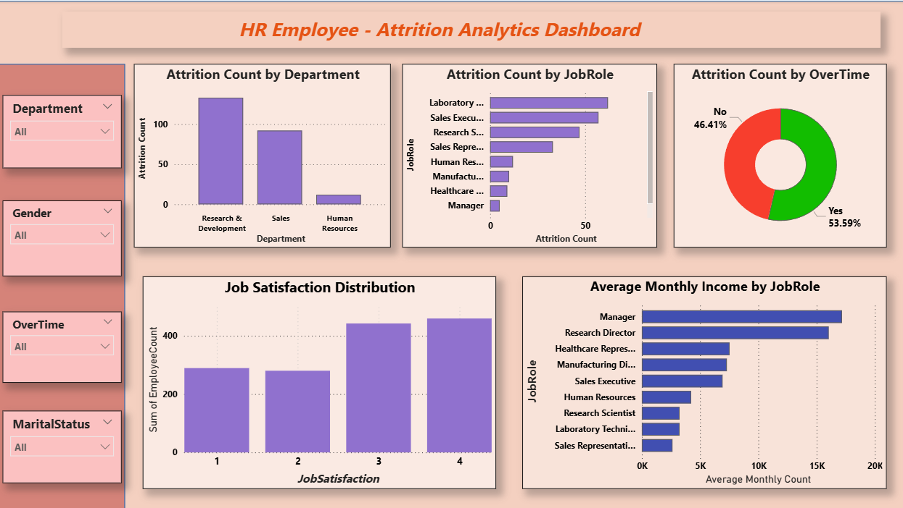

# 📊 HR Employee Attrition Analytics Dashboard

An interactive **Power BI dashboard** built using the **IBM HR Employee Attrition Dataset** to analyze employee attrition, workforce demographics, job satisfaction, overtime trends, and salary distribution. This project demonstrates the complete data analytics workflow, including **data cleaning, exploratory data analysis (EDA), data transformation, DAX measures, and interactive dashboard development**.

---

# 📌 Project Overview

Employee attrition is a critical HR metric that affects recruitment costs, employee productivity, and organizational performance. This project converts raw HR data into meaningful business insights through an interactive Power BI dashboard.

---

# 🎯 Objectives

- Analyze employee attrition across departments and job roles.
- Identify the impact of overtime on employee attrition.
- Compare average monthly income across job roles.
- Evaluate employee job satisfaction.
- Build an interactive dashboard for HR decision-making.

---

# 📂 Dataset

**Dataset:** IBM HR Employee Attrition Dataset

- **Records:** 1,470
- **Columns:** 35

### Key Features

- Attrition
- Age
- Department
- Job Role
- Monthly Income
- OverTime
- Job Satisfaction
- Gender
- Marital Status
- Education
- YearsAtCompany

---

# 🛠 Tools & Technologies

- Microsoft Power BI
- Power Query
- DAX (Data Analysis Expressions)
- Python
- Jupyter Notebook
- Pandas
- Matplotlib
- IBM HR Employee Attrition Dataset

---

# 📓 Data Cleaning & Exploratory Data Analysis

The project includes a Jupyter Notebook that documents the complete data preparation process before dashboard development.

### Data Cleaning Steps

- Imported the HR dataset
- Explored dataset structure
- Checked data types
- Verified missing values
- Checked duplicate records
- Identified numerical and categorical features
- Performed Exploratory Data Analysis (EDA)
- Prepared the dataset for visualization

### Exploratory Data Analysis (EDA)

- Employee Attrition Distribution
- Age Distribution
- Department Distribution
- Monthly Income Distribution
- Job Satisfaction Distribution

---

# ⚙ Data Preparation

### Power Query

- Cleaned and transformed the dataset
- Verified data consistency
- Prepared the data model for reporting

### DAX Measures

- Total Employees
- Attrition Count
- Attrition Rate
- Average Age
- Average Monthly Income
- Average Job Satisfaction

---

# 📊 Dashboard Overview

The dashboard provides interactive visualizations to analyze employee attrition and workforce trends.

### KPI Cards

- 👥 Total Employees
- 📉 Attrition Count
- 📈 Attrition Rate
- 🎂 Average Age
- 💰 Average Monthly Income
- ⭐ Average Job Satisfaction

### Charts

- Attrition by Department
- Attrition by Job Role
- Attrition by OverTime
- Job Satisfaction Distribution
- Average Monthly Income by Job Role

### Interactive Slicers

- Department
- Gender
- OverTime
- Marital Status

---

# 📷 Dashboard Preview

```text
Image/
└── Dashboard.png
```


```markdown
## 📷 Dashboard Preview


```

---

# 💡 Key Business Insights

- Research & Development has the highest employee attrition.
- Employees working overtime are more likely to leave the organization.
- Managers and Research Directors have the highest average monthly income.
- Job satisfaction is an important indicator of employee retention.
- Interactive filters enable detailed workforce analysis.

---

# 📈 Business Impact

This dashboard helps organizations:

- Monitor employee turnover
- Identify high-risk departments
- Improve employee retention strategies
- Support workforce planning
- Make data-driven HR decisions

---

# 🚀 Future Scope

- Build predictive attrition models using Machine Learning.
- Connect the dashboard to a live HR database.
- Add historical trend analysis.
- Create executive-level HR dashboards.
- Integrate real-time HR analytics.

---

# 📁 Project Structure

```text
HR-Employee-Attrition-Analytics/
│
├── Image/
│   └── Dashboard.png
│
├── Dataset/
│   └── HR-Employee-Attrition.csv
│
├── Notebook/
│   └── HR Employee Attrition.ipynb
│
├── Dashboard/
│   └── HR_Analytics_Dashboard.pbix
│
├── Report/
│   └── HR_Employee_Attrition_Report.pdf
│
└── README.md
```

---

# ⭐ Skills Demonstrated

- Power BI Dashboard Development
- Data Cleaning
- Exploratory Data Analysis (EDA)
- Power Query
- DAX
- Data Visualization
- Business Intelligence
- HR Analytics
- KPI Design

---

